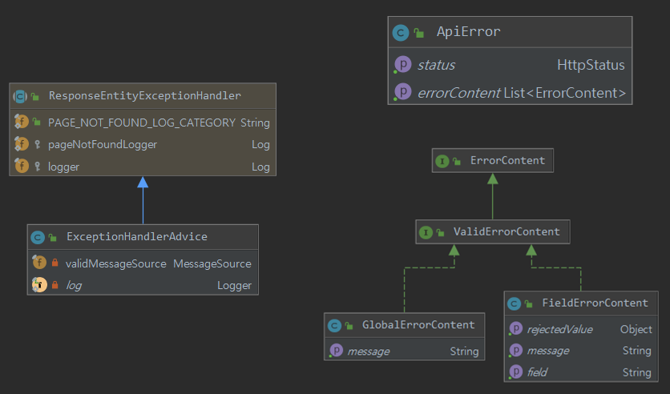

# ExceptionHandlerAdvice
- 어플리케이션에서 발생한 모든 예외를 처리합니다.
- Spring의 ResponseEntityExceptionHandler를 상속 받아 코드를 작성했습니다.
- MessageSource를 사용하여 예외 메세지를 전달합니다. 
    - 커스텀 예외
      ~~~
      public class AleadyAuthenticatedException extends CustomRuntimeException {
          public AleadyAuthenticatedException(){
              super("email.aleady.authenticate");
          }
      ~~~
    - [@Valid와 MessageSource 사용하기](https://dingdongdeng.tistory.com/19).

- diagram
    - 
    
- 각각의 메소드는 @Valid에서 발생한 예외, multipart/form-data에서 발생한 예외, 커스텀 예외에 대하여 일정한 형식으로 클라이언트에게 응답합니다.
- 필드값에 의해 발생한 예외는 FieldErrorContent를 사용합니다.
- 그 외의 예외는 GlobalErrorContent를 사용합니다.
- 앞의 두 클래스의 포함하는 ErrorContent를 이용하여, ApiError에 담아 리스트 형태로 클라이언트에 응답합니다.
  
  참고 : ApiError, FieldErrorContent 클래스 등의 소스는 com.board.portfolio.exception 패키지 참고 
~~~
@RequiredArgsConstructor
@RestControllerAdvice
public class ExceptionHandlerAdvice extends ResponseEntityExceptionHandler {
    private final MessageSource validMessageSource;
    @Override
    protected ResponseEntity<Object> handleBindException(BindException ex, HttpHeaders headers, HttpStatus status, WebRequest req) {
        List<ErrorContent> contentList = getErrorContentList(ex, BindException.class);
        return responseWithBody(ex, new ApiError(HttpStatus.BAD_REQUEST, contentList), req);
    }

    @Override
    protected ResponseEntity<Object> handleMethodArgumentNotValid(MethodArgumentNotValidException ex, HttpHeaders headers, HttpStatus status, WebRequest req) {
        List<ErrorContent> contentList = getErrorContentList(ex, MethodArgumentNotValidException.class);
        return responseWithBody(ex,new ApiError(HttpStatus.BAD_REQUEST,contentList), req);
    }

    @ExceptionHandler(ConstraintViolationException.class)
    public ResponseEntity<Object> constraintViolationException(ConstraintViolationException ex, WebRequest req, Locale locale){
        List<ErrorContent> contentList = getErrorContentList(ex, ConstraintViolationException.class);
        return responseWithBody(ex,new ApiError(HttpStatus.BAD_REQUEST,contentList),req);
    }

    @ExceptionHandler(AccessDeniedException.class)
    public ResponseEntity<Object> accessDeniedException(AccessDeniedException ex, WebRequest req, Locale locale){
        String message = validMessageSource.getMessage("signin.need", null,locale);
        return responseWithBody(ex, new ApiError(HttpStatus.BAD_REQUEST,Arrays.asList(new GlobalErrorContent(message))), req);
    }
    @ExceptionHandler(FieldException.class)
    public ResponseEntity fieldException(FieldException ex, WebRequest req, Locale locale){
        String message = validMessageSource.getMessage(ex.getMessage(), null,locale);
        return responseWithBody(ex, new ApiError(HttpStatus.BAD_REQUEST,Arrays.asList(new FieldErrorContent(ex.getFieldName(),message,ex.getRejectedValue()))), req);
    }

    @ExceptionHandler(CustomRuntimeException.class)
    public ResponseEntity customRuntimeException(CustomRuntimeException ex, WebRequest req, Locale locale){
        String message = validMessageSource.getMessage(ex.getMessage(), null,locale);
        return responseWithBody(ex, new ApiError(HttpStatus.BAD_REQUEST,Arrays.asList(new GlobalErrorContent(message))), req);
    }

    @ExceptionHandler(RuntimeException.class)
    public ResponseEntity runtimeException(RuntimeException ex, WebRequest req){
        log.error("runtimeException ", ex);
        String message = ex.getMessage();
        return responseWithBody(ex, new ApiError(HttpStatus.BAD_REQUEST,Arrays.asList(new GlobalErrorContent(message))), req);
    }

    private ResponseEntity<Object> responseWithBody(Exception ex, ApiError body, WebRequest request){
        return super.handleExceptionInternal(ex, body, new HttpHeaders(), body.getStatus(), request);
    }

    private List<ErrorContent> getErrorContentList(Exception e,Class aClass){

        List<ErrorContent> contentList = new ArrayList<>();
        if(MethodArgumentNotValidException.class.isAssignableFrom(aClass)){
            MethodArgumentNotValidException ex = (MethodArgumentNotValidException) e;
            addFieldErrors(contentList, ex.getBindingResult().getFieldErrors());
            addGlobalErrors(contentList, ex.getBindingResult().getGlobalErrors());
        }
        else if(BindException.class.isAssignableFrom(aClass)){
            BindException ex = (BindException) e;
            addFieldErrors(contentList, ex.getBindingResult().getFieldErrors());
            addGlobalErrors(contentList, ex.getBindingResult().getGlobalErrors());
        }
        else if(ConstraintViolationException.class.isAssignableFrom(aClass)){
            ConstraintViolationException ex = (ConstraintViolationException) e;
            addGlobalErrors(contentList, ex.getConstraintViolations());
        }

        return contentList;
    }

    private void addFieldErrors(List<ErrorContent> contentList, List<FieldError> fieldErrorList){
        for(FieldError error : fieldErrorList){
            contentList.add(new FieldErrorContent(
                    error.getField(),
                    error.getDefaultMessage(),
                    error.getRejectedValue()
            ));
        }
    }

    private void addGlobalErrors(List<ErrorContent> contentList, List<ObjectError> globalErrorList){
        for(ObjectError error : globalErrorList){
            contentList.add(new GlobalErrorContent(
                    error.getDefaultMessage()
            ));
        }
    }

    private void addGlobalErrors(List<ErrorContent> contentList, Set<ConstraintViolation<?>> constraintViolations){
        List constraintViolationList = constraintViolations.stream().collect(Collectors.toList());
        for(Object object : constraintViolationList){
            ConstraintViolation constraintViolation = (ConstraintViolation)object;
            contentList.add(new GlobalErrorContent(
                    constraintViolation.getMessage()
            ));
        }
    }

}
~~~
    
    
