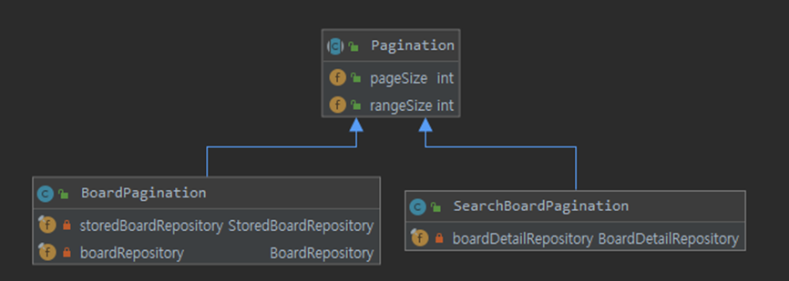

# paging 패키지
- 페이징을 커스텀하게 사용하기 위한 패키지입니다.
- Pagination 클래스를 상속 받아 용도에 따라 커스텀하게 오버라이드하여 사용합니다.

- diagram
    - 
    

- 상속받을 클래스는 getNowPageList 메소드와 getTotalCnt 메소드를 오버라이드하여 사용하면 됩니다. 
~~~
public abstract class Pagination {
    public int pageSize;
    public int rangeSize;

    public Pagination(int pageSize, int rangeSize){
        this.pageSize = pageSize;
        this.rangeSize = rangeSize;
    }

    private PaginationInfo getPaginationInfo(long total, int page){
        return new PaginationInfo(total, page, this.rangeSize, this.pageSize);
    }

    /**
     * getNowPageList()를 통해 현재페이지 목록을 어떻게 구하지는 @Override
     * getTotalCnt()를 통해 전체 개수를 어떻게 구하는지 @Override
     */
    abstract List getNowPageList(int page, PaginationInfo info, int pageSize, int rangeSize, Object object);
    abstract long getTotalCnt(Object object);

    public PagingResult getPagingResult(int page, Object object){
        long total = getTotalCnt(object);
        PaginationInfo info = getPaginationInfo(total, page);
        return new PagingResult(getNowPageList(page, info, this.pageSize, this.rangeSize, object), info);
    }
    public PagingResult getPagingResult(int page){
        return getPagingResult(page,new Object());
    }

}
~~~

- 아래는 검색조건을 바탕으로 페이징을 하는 예시입니다.
    - getNowPageList 메소드를 조건(Object object)과 파라미터들에 따라 현재페이지 목록을 구하도록 오버라이드 합니다.
    - getTotalCnt 메소드를 조건(Object object)에 따라 전체페이지를 구하도록 오버라이드 합니다.
    - 용도에 따라 오버라이드 내용만 변경하면 됩니다.
~~~
@Component
public class SearchBoardPagination extends Pagination {

    private final BoardDetailRepository boardDetailRepository;
    @Autowired
    public SearchBoardPagination(@Value("${board.pageSize}") int pageSize,
                                 @Value("${board.rangeSize}") int rangeSize,
                                 BoardDetailRepository boardDetailRepository){
        super(pageSize, rangeSize);
        this.boardDetailRepository = boardDetailRepository;
    }

    @Override
    public List getNowPageList(int page, PaginationInfo info, int pageSize, int rangeSize, Object object) {
        return boardDetailRepository.getSearchBoardList(info.getStartNum(), pageSize, (BoardDTO.Search) object);
    }

    @Override
    public long getTotalCnt(Object object) {
        return boardDetailRepository.searchBoardCnt((BoardDTO.Search) object);
    }
}

~~~
    
