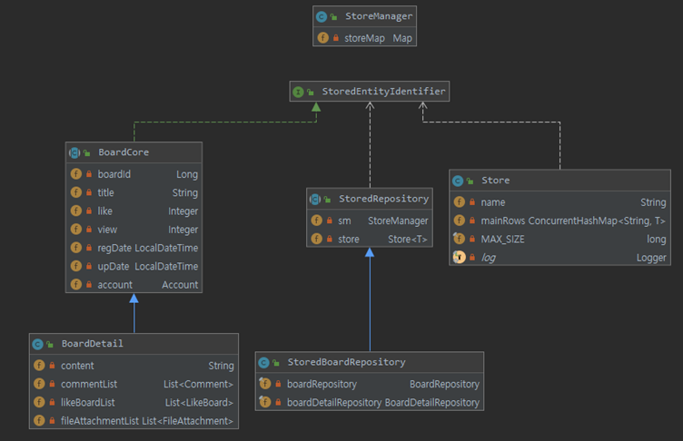
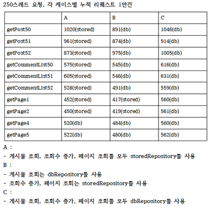

# store 패키지
- JpaRepository를 통해 조회한 값을 바인딩하여, 캐싱과 비슷한 역할을 하게 하는 로직을 담은 패키지입니다.
- 게시판 목록을 캐싱하고 싶었지만, 조회수, 좋아요 등에 변경사항이 발생할때 쿼리캐싱이 무효화되는 문제, 2차 캐시로는 처리 할 수 없는 점이 존재하여 해당 패키지를 작성하였습니다.

- 관계도
    - 
- 성능테스트(Jmeter) 
    - 
## StoreManager
- StoreConfig에서 bean으로 생성하여 초기에 어떤 값을 캐싱할지 설정합니다.
    - 아래 코드는 게시판 목록을 캐싱하기 위해 임의 개수만큼의 게시물을 쿼리하여 StoreManager에게 전달하고 있습니다.
    - 전달할때는 Store 클래스를 사용하여 전달합니다.
~~~
@Configuration
public class StoreConfig {
    @Autowired
    private BoardDetailRepository boardDetailRepository;

    @Bean
    public StoreManager storeManager(@Value("${board.pageSize}") int pageSize,
                                     @Value("${board.rangeSize}") int rangeSize){
        int MAX_SIZE = pageSize*rangeSize;
        return new StoreManager(new Store<BoardDetail>("board",boardDetailRepository.getBoardList(MAX_SIZE),MAX_SIZE));
    }
}
~~~
- StoreManager는 생성자를 통해 Map storeMap 을 정의합니다.
- name 값으로 구분하여, 여러용도에 따라 사용할 수 있도록 고려했습니다.
~~~
@Getter
public class StoreManager {
    private Map storeMap;
    public StoreManager(Store...stores){
        storeMap = new HashMap();
        for(Store store : stores){
            storeMap.put(store.getName(), store);
        }
    }

}
~~~

## StoredRepository
- StoreRepository는 다른 클래스에서 상속받아 사용하도록 만든 추상클래스 입니다.
- save 메소드와, delete 메소드를 정의하여 사용 가능합니다.
- 기존 JpaRepository와 유사한 사용법을 갖도록 노력했습니다.
~~~
public abstract class StoredRepository<T extends StoredEntityIdentifier<?>> {
    private StoreManager sm;
    private Store<T> store;

    public StoredRepository(String name, StoreManager sm){
        this.store = (Store<T>)(sm.getStoreMap().get(name));
        this.sm = sm;
    }

    private List<T> getMainRows(){
        return this.store.getMainRows();
    }
    public long storedSize(){
        return this.store.savedRowSize();
    }
    public void saveStore(T entity){
        store.saveRow(entity);
    }
    public void deleteStore(T entity){
        store.deleteRow(entity);
    }
    public List<T> getList(){
        return this.store.getMainRows();
    }
    public List<T> getList(long start, long size){
        return getMainRows().stream()
                .skip(start-1)
                .limit(size)
                .collect(Collectors.toList());
    }
    public List<?> getList(long start, long size, Function<T,?> func){
        return getMainRows().stream()
                .map(func)
                .skip(start-1)
                .limit(size)
                .collect(Collectors.toList());
    }

    public Optional<T> findByIdFromStore(String id){
        return store.findById(id);
    }
    public Optional<T> findByIdFromStore(Long id ){
        return store.findById(id);
    }

    public abstract T save(T entity);
    public abstract void delete(T entity);

}
~~~
## StoredBoardRepository
- 위의 StoredRepository를 상속받은 게시판 목록 캐시를 관리를 위한 repository입니다.
- 엔티티에 변경사항이 발생하면 StoredBoardRepository는 동기화를 고려하며 변경사항을 반영합니다.
- 예시와 같은 방식으로 사용합니다.
    - storedBoardRepository.increaseView(this.boardId);
    - storedBoardRepository.save(board);
    - storedBoardRepository.delete(board);
~~~
@Component
public class StoredBoardRepository extends StoredRepository<BoardDetail> {

    private final BoardRepository boardRepository;
    private final BoardDetailRepository boardDetailRepository;

    @Autowired
    public StoredBoardRepository(BoardRepository boardRepository,
                                 BoardDetailRepository boardDetailRepository,
                                 StoreManager sm) {
        super("board",sm);
        this.boardRepository = boardRepository;
        this.boardDetailRepository = boardDetailRepository;
    }

    public List<Board> getBoardList(int page, long startNum, int pageSize){
        if(page<=storedSize()/pageSize){
            return (List<Board>)getList(startNum,pageSize,o->o.transToBoard());
        }
        return boardRepository.getBoardList(startNum, pageSize);
    }

    public void increaseView(Long id) {
        findByIdFromStore(id).ifPresent(o->o.increaseView());
    }

    public void updatePost(Long id, String title, String content, LocalDateTime update){
        findByIdFromStore(id).ifPresent(o->{
            o.setTitle(title);
            o.setContent(content);
            o.setUpDate(update);
        });
    }
    public void decreaseLike(Long id){
        findByIdFromStore(id).ifPresent(o->o.decreaseLike());
    }
    public void increaseLike(Long id){
        findByIdFromStore(id).ifPresent(o->o.increaseLike());
    }

    public Optional<BoardDetail> findById(Long id){
        try{
            return Optional.of(
                    boardDetailRepository
                            .save(findByIdFromStore(id).orElseThrow(NotFoundStoredEntityException::new)));
        }
        catch (NotFoundStoredEntityException ex){
            return boardDetailRepository.findById(id);
        }

    }

    @Override
    public BoardDetail save(BoardDetail entity) {
        BoardDetail boardDetail = boardDetailRepository.save(entity);
        saveStore(entity);
        return boardDetail;
    }

    @Override
    public void delete(BoardDetail entity) {
        boardDetailRepository.delete(entity);
        deleteStore(entity);
    }

}
~~~
## StoredEntityIdentifier
- StoredRepository를 이용해 관리할 엔티티는 StoredEntityIdentifier<T>를 구현해야합니다.
    - store패키지의 클래스들이 해당 엔티티의 기본키가 어떤 타입인지 알기 위함입니다.
~~~
public interface StoredEntityIdentifier<T> {
    T getId();
}
~~~
~~~
public abstract class BoardCore extends EntityDefaultValues implements StoredEntityIdentifier<Long> {
//생략....
~~~
## Store
- Store에서는 캐싱된 내용들을 관리할 수 있는 로직들이 존재합니다.
- ConcurrentHashMap을 사용하여 동시성을 고려하면서도 성능적 장점을 이끌어낼 수 있도록 하였습니다.
~~~
@Getter
public class Store<T extends StoredEntityIdentifier> {
    /**
     * mainRows와 subRows는 외부에서 참조하여 값이 바뀔 수 있음으로
     * 매우 주의가 필요함
     */
    private String name;
    private ConcurrentHashMap<String, T> mainRows; //ConcurrentMap
    private final long MAX_SIZE;

    public Store(String name, long MAX_SIZE){
        this.name = name;
        this.MAX_SIZE = MAX_SIZE;
    }
    public Store(String name, List<T> mainRows, long MAX_SIZE){
        this(name, MAX_SIZE);
        this.mainRows = new ConcurrentHashMap<>();
        mainRows.stream().limit(MAX_SIZE).forEach(o->this.mainRows.put(o.getId().toString(),o));
    }
    public long savedRowSize(){
        return mainRows.size();
    }
    public void resetRows(){
        mainRows.clear();
    }
    public List<T> getMainRows(){
        List list = new ArrayList<T>(mainRows.values());
        list.sort(getSort());
        return list;
    }
    private Comparator<T> getSort(){
        Comparator<T> comparator = (o1, o2)->{
            long id1= Long.valueOf(o1.getId().toString());
            long id2 = Long.valueOf(o2.getId().toString());
            return id1<id2?1:id1==id2?0:-1;
        };
        return comparator;
    }
    public Optional<T> findById(Object id){
        return Optional.ofNullable(mainRows.get(id.toString()));
    }

    public void saveRow(T row) {
        mainRows.put(row.getId().toString(),row);
        if(mainRows.size() > MAX_SIZE){
            List<T> list = new ArrayList<T>(mainRows.values());
            list.sort(getSort());
            mainRows.remove(list.get((int) MAX_SIZE).getId().toString());
        }
    }

    public void deleteRow(T entity) {
        mainRows.remove(entity.getId().toString());
    }
}
~~~ 
