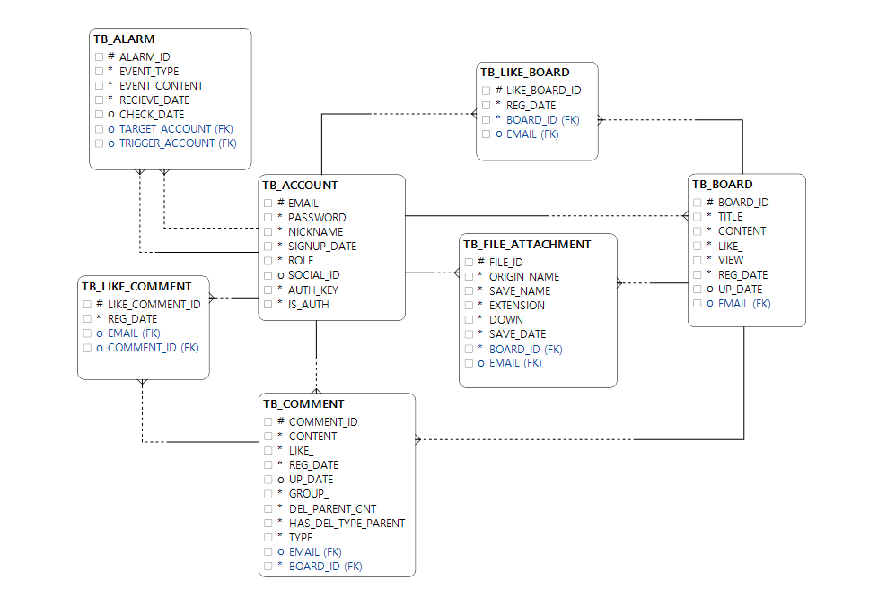

## 표준 정의서
### 게시판
- SPA web
- vue.js
- spring boot
- spring security
- spring data jpa
- Querydsl
- MySQL
- jmeter

### Git Branch
- master/origin
- dev

## 필요한 config.properties
- /resources/properties/private/database-config.properties
~~~
# MySQL Configuration
#spring.datasource.driver-class-name=com.mysql.cj.jdbc.Driver
spring.datasource.driver-class-name=com.mysql.cj.jdbc.Driver
spring.datasource.url=jdbc:mysql://localhost:3306/portfolio_board?useSSL=false&characterEncoding=UTF-8&serverTimezone=Asia/Seoul

spring.datasource.username=root
spring.datasource.password=1234

spring.datasource.hikari.maximum-pool-size=10
spring.datasource.hikari.minimum-idle=2
spring.datasource.hikari.connection-test-query=select now()

spring.jpa.generate-ddl=false
spring.jpa.show-sql=true
spring.jpa.database=mysql
~~~ 
- /resources/properties/private/jwt-config.properties
~~~
# jwt decode & encode 문자열
jwt.secret=JWT
jwt.token.name=jwt-token
jwt.cookie.name=jwt-token
~~~
- /resources/properties/private/mail-config.properties
~~~
spring.mail.host=smtp.gmail.com
spring.mail.port=587
spring.mail.username= 구글메일
spring.mail.password= 구글메일 비밀번호
spring.mail.properties.mail.smtp.starttls.enable=true
spring.mail.properties.mail.smtp.auth=true

mail.from=[발송자 별명]<구글메일>
mail.auth.limit =메일인증 유효시간 밀리세컨즈(ex 360000) 
~~~
## DataBase

ERD

 

 
DDL

 
 ~~~
create table TB_ACCOUNT(
    EMAIL varchar(100),
    PASSWORD varchar(100) not null ,
    NICKNAME varchar(30) unique ,
    SIGNUP_DATE datetime default now(),
    ROLE varchar(30) default 'MEMBER',
    SOCIAL_ID varchar(100) unique,
    AUTH_KEY varchar(40) not null,
    IS_AUTH boolean default false,
    primary key(EMAIL)
);
~~~

~~~
create table TB_BOARD(
     BOARD_ID int auto_increment,
     TITLE varchar(110) not null ,
     CONTENT varchar(750) not null ,
     LIKE_ int default 0,
     VIEW int default 0,
     REG_DATE datetime default now(),
     UP_DATE datetime,
     EMAIL varchar(100) ,
     primary key (BOARD_ID),
     foreign key (EMAIL) REFERENCES TB_ACCOUNT(EMAIL) on delete set null
);
~~~
~~~
create table TB_COMMENT(
    COMMENT_ID int auto_increment,
    BOARD_ID int not null ,
    CONTENT varchar(350) not null ,
    LIKE_ int default 0,
    REG_DATE datetime default now(),
    UP_DATE datetime,
    EMAIL varchar(100),
    GROUP_ int not null, ##COMMENT_ID 값이 들어감
    DEL_PARENT_CNT int default 0,
    HAS_DEL_TYPE_PARENT boolean,
    TYPE varchar(30) not null, ##PARENT_ID가 NULL 인데 TYPE이 CHILD면 알수없음 댓글 만들면 됨
    primary key (COMMENT_ID),
    foreign key (BOARD_ID) REFERENCES  TB_BOARD(BOARD_ID) on delete cascade ,
    foreign key (EMAIL) REFERENCES TB_ACCOUNT(EMAIL) on delete set null
);
~~~
~~~
create table TB_LIKE_BOARD(
    LIKE_BOARD_ID varchar(40),
    BOARD_ID int not null ,
    EMAIL varchar(100) ,
    REG_DATE datetime default now(),
    primary key (LIKE_BOARD_ID),
    foreign key (BOARD_ID) REFERENCES TB_BOARD(BOARD_ID) on delete cascade ,
    foreign key (EMAIL) REFERENCES TB_ACCOUNT(EMAIL) on delete set null
);
~~~
~~~
create table TB_LIKE_COMMENT(
    LIKE_COMMENT_ID varchar(40),
    COMMENT_ID int not null ,
    EMAIL varchar(100) ,
    REG_DATE datetime default now(),
    primary key (LIKE_COMMENT_ID),
    foreign key (COMMENT_ID) REFERENCES TB_COMMENT(COMMENT_ID) on delete cascade ,
    foreign key (EMAIL) REFERENCES TB_ACCOUNT(EMAIL) on delete set null
);
~~~
~~~
create table TB_FILE_ATTACHMENT(
    FILE_ID varchar(40),
    BOARD_ID int not null,
    ORIGIN_NAME varchar(70) not null ,
    SAVE_NAME varchar(70) unique ,
    EXTENSION varchar(20) not null ,
    DOWN int default 0,
    SAVE_DATE datetime default now(),
    EMAIL varchar(100) not null,
    primary key(FILE_ID),
    foreign key (BOARD_ID) REFERENCES TB_BOARD(BOARD_ID) on delete cascade,
    foreign key (EMAIL) REFERENCES TB_ACCOUNT(EMAIL) on delete cascade
);
~~~
~~~
create table TB_ALARM(
    ALARM_ID varchar(40),
    TARGET_ACCOUNT varchar(100) not null ,
    TRIGGER_ACCOUNT varchar(100) ,
    EVENT_TYPE varchar(100) not null ,
    EVENT_CONTENT_ID varchar(100) not null ,
    RECIEVE_DATE datetime default now(),
    CHECK_DATE datetime,
    primary key (ALARM_ID),
    foreign key (TARGET_ACCOUNT) REFERENCES TB_ACCOUNT(EMAIL) on delete cascade,
    foreign key (TRIGGER_ACCOUNT) REFERENCES TB_ACCOUNT(EMAIL) on delete set null
);
~~~
 

 
TB_ACCOUNT

|항목            | 설명                |key type    |data type              | unique   | nullable  |비고               |
 |----------------|--------------------|------------|-----------------------|----------|----------|-------------------|
 |EMAIL           |회원의 이메일        |primary     |varchar(100)             | unique   | not null |   이메일 패턴이여야 함, 최소 5자, 최대 40자|   
 |PASSWORD     	 |회원의 비밀번호		   |            | varchar(100)            |         | not null |숫자,영문,특문 8자이상 16이하 -> 암호화|
 |NICKNAME     	 |회원의 별명		   |           | varchar(30)            | unique   |          |최소4자 이상, 10자이하      |
 |SIGNUP_DATE  	 |회원 가입일		   |           | DATETIME default now() |          | not null |                      |                       |
 |ROLE       	 |회원의 권한		   |           | varchar(30) default 'MEMBER'|          | not null |MEMBER, ADMIN, SYSTEM 중 하나  |
 |SOCIAL_ID    	 |소셜 아이디		   |           | varchar(100)            | unique   | null     |소셜에서 제공하는 ID     |
 |AUTH_KEY       |이메일 인증을 위한 키 |           | varchar(40)           |            | not null | 무작위 문자열   |
 |IS_AUTH        |이메일 인증을 한 계정인지 명시|    | boolean default false  |             | not null|  이메일 인증을 마치면 true  |

 
TB_BOARD

 
  |항목            | 설명                |key type                            |data type              | unique   | nullable  |비고                 |
 |---------------|---------------------|-----------------------------------|-----------------------|----------|-----------|---------------------|
 |BOARD_ID            |게시글 식별 번호      | primary(auto inc)                        | int                     |   unique | not null  |   |
 |TITLE          |게시글의 제목			|                                 |varchar(110)            |           | not null  | 공백금지,50자 이하   |
 |CONTENT     	|게시글의 내용			|                                 |varchar(750)            |           | not null  |공백금지,350자 이하   |
 |LIKE_     	|게시글의 좋아요			|                                 | int default 0          |          | not null  |                      |
 |VIEW       	|게시글의 조회수			 |                               | int default 0           |          | not null |                       |
 |REG_DATE     	|게시글 생성 날짜		    |                                | datetime default now()  |            |not null |                      |
 |UP_DATE     	|게시글 수정 날짜		    |                                | datetime                |           | null   |                        |
 |EMAIL         |게시글의 작성자         |	foreign(TB_ACCOUNT) on delete set null   |varchar(100)              |            |        |   이메일 패턴이여야 함|

 

 
TB_COMMENT

 
 |항목            | 설명                |key type                            |data type              | unique   | nullable  |비고                 |
 |---------------|---------------------|-----------------------------------|-----------------------|----------|-----------|---------------------|
 |COMMENT_ID            |댓글을 식별하는 ID|primary(auto inc)                | int         | unique     | not null  |                  |
 |BOARD_ID            |댓글이 작성된 게시물 ID |foreign(TB_BOARD) on delete casecade| int              |             | not null  |     |
 |CONTENT        |댓글의 내용            |                                  | varchar(350)       |           |   not null  |공백금지,150자이하      |
 |LIKE_     	|댓글의 좋아요		    |                                  | int default 0      |           |   not null  |                      |
 |REG_DATE       |댓글의 생성 날짜        |                                 | datetime default now()|        |  not null |                         |
 |UP_DATE       |댓글의 수정 날짜        |                                  |datetime|                      | null |                              |
 |EMAIL         |댓글의 작성자           | foreign(TB_ACCOUNT) on delete set null| varchar(100)     |         |   null |이메일 패턴이여야 함            |
 |GROUP_        |댓글의 그룹 번호(COMMNET_ID)|                              |int                  |           |not null      |대댓글 관계를 구분하기 위함|
 |DEL_PARENT_CNT|삭제된 부모댓글의 개수    |                                | int default 0        |           |not null||
 |HAS_DEL_TYPE_PARENT |삭제된 부모댓글들 중 타입 PARENT가 있는지 |           | boolean             |            |          |                       |
 |TYPE          |댓글이 부모인지, 자식인지 구분|                               |varchar(30)        |           |not null|              |
 
 

 
 
 

 
TB_LIKE_BOARD

 
 |항목            | 설명                          |key type                             |data type                      | unique   | nullable  |비고                 |
 |---------------|-------------------------------|-------------------------------------|-------------------------------|----------|-----------|---------------------|
 |LIKE_BOARD_ID             |좋아요 이력을 식별하는 UUID      | primary                             | varchar(40)                   | unique  | not null  |             |
 |BOARD_ID            | "좋아요"가 눌린 게시물 ID       | foreign(TB_BOARD)  on delete cascade| int                           |          | not null  |                    |
 |EMAIL          | "좋아요"를 누른 유저             | foreign(TB_ACCOUNT) on delete set null |varchar(100)                 |          |    null | 이메일 패턴이여야 함  |
 |REG_DATE      	 | "좋아요"를 누른 날짜             |                                     | datetime default now()     |          |not null |                      |
 
 

 
 

 
TB_LIKE_COMMENT

 
  |항목            | 설명                          |key type                             |data type                      | unique   | nullable  |비고                 |
  |---------------|-------------------------------|-------------------------------------|-------------------------------|----------|-----------|---------------------|
  |LIKE_COMMENT_ID             |좋아요 이력을 식별하는 ID      | primary                             | int                    | unique  | not null  |                     |
  |COMMENT_ID            | "좋아요"가 눌린 댓글 ID         | foreign(TB_COMMENT)  on delete cascade| varchar(40)                   |          | not null  |                    |
  |EMAIL          | "좋아요"를 누른 유저             | foreign(TB_ACCOUNT) on delete set null |varchar(100)|                |  null | 이메일 패턴이여야 함  |
  |REG_DATE      	 | "좋아요"를 누른 날짜          |                                  | datetime default now()        |          |not null |                      |
 
 

 
  
 

 
TB_FILE_ATTACHMENT

 
 |항목            | 설명                          |key type                             |data type                      | unique   | nullable  |비고                 |
 |---------------|-------------------------------|-------------------------------------|-------------------------------|----------|-----------|---------------------|
 |FILE_ID            | 파일을 식별하는 UUID            |primary                              | varchar(40)                  | unique    | not null |                      |
 |BOARD_ID            | 파일이 저장된 게시물 ID         |foreign(TB_BOARD) on delete cascade   | int                         |           |  not null   |                   |
 |ORIGIN_NAME    | 파일의 원래 이름                |                                     |  varchar(70)                 |             |not null      |  공백금지, 확장자 필요|
 |SAVE_NAME     | 파일이 서버에 저장된 이름(FID+확장자)|                                  |  varchar(70)                  |   unique    |   not null   공백금지, 확장자 필요  |
 |EXTENSION      | 파일의 확장자                   |                                   | varchar(20)                   |              |not null   |     10글자 이상불가     |
 |DOWN           | 파일 다운로드 횟수              |                                    |   int default 0             |               | not null |                    |
 |SAVE_DATE      | 파일이 저장된 날짜              |                                    |  datetime default now()     |                | not null|                    |
 |EMAIL          | 파일을 저장한 사용자의 이메일    | foreign(TB_ACCOUNT) on delete cascade |  varchar(100)              |              |  not null |                   |
 
 

 

 
TB_ALARM

 
 |항목            | 설명                                           |key type                             |data type                      | unique   | nullable  |비고                 |
 |---------------|------------------------------------------------|-------------------------------------|-------------------------------|----------|-----------|---------------------|
 |ALARM_ID            | 알람을 식별하는 UUID                             |primary                              | varchar(40)                   | unique   | not null  |                    |
 |TARGET_ACCOUNT   | 알람을 받은 대상(시스템, 관리자, 다른 회원 등)      |foreign(TB_ACCOUNT) on delete cascade | varchar(100)                  |          | not null  |  대상 ID      |
 |TRIGGER_ACCOUNT   | 알람을 발생시킨 대상(시스템, 관리자, 다른 회원 등) |foreign(TB_ACCOUNT) on delete cascade |  varchar(100)                 |         |  null  |  대상 ID         |
 |EVENT_TYPE      | 어떤 알람 이벤트인지(좋아요 알림, 대댓글알림 , 시스템 공지 등)|                           |  varchar(100)                |          | not null   |  40자 이상 불가 |
 |EVENT_CONTENT_ID   | 알람이벤트가 발생한 컨텐츠의 ID                  |                                   |  varchar(100)                  |         |not null    |                |
 |RECIEVE_DATE      | 알람을 받은 날짜                                 |                                   | datetime default now()         |         |  not null  |                 |
 |CHECK_DATE      | 알람을 읽은 날짜                                 |                                    | datetime                       |          | null      |                 |

 

~~~
## table 제거
drop table TB_ALARM;
drop table TB_FILE_ATTACHMENT;
drop table TB_LIKE_BOARD;
drop table TB_LIKE_COMMENT;
drop table TB_COMMENT;
drop table TB_BOARD;
drop table TB_ACCOUNT;
~~~

 ## Spring Security
 ### Filter
 |경로                    |예외경로            |Filter         | Provider                                  |success                             |fail                      |
 |------------------------|-------------------|-------------|--------------------------------------------|-------------------------------------|-----------------------|
 |/api/account/signIn     |                   |SignInFilter   | 로그인 성공 여부 판단                      | jwt토큰을 쿠키에 담아 반환           | Exception 발생        |
 |/api/account/signOut     |                   |SignOutFilter   | 없음                      | contextholder를 비우고 쿠키제거           |         |
 |/api/**                 |/api/account/signIn,signOut|JwtFilter      | 토큰 유효성 판단(토큰이 없는 경우는 success)| chain.doFilter()                    | Exception 발생        |
 
 
 
 ## 할 것
 - 커스텀한 예외를 못던지는 경우들을 해결해야해
 - security의 exception 처리를 추가해야함
     - @initBinder로 처리하는 validator가 떨구는 예외도 처리해서 내보내야함
     - message관련, mail관련 exception 발생하면 클라이언트에 "메일발송실패" 뜨게하자, rollback도 되야하고
 - 메일인증 링크 클릭시 보일 화면 추가
 - 인증유효시간 30분이 지날경우를 적용
     - 스레드세이프하게 다시 생각해보자(syncronized?)
 - @FileSize , @FileExtension 대충 복붙한거 리팩토링필요함
     - extension 유효성 검사에서 . 으로 나누고 length 2아닐때 예외던지게 했는데 고쳐야함(ex: abc.def.hwp)
 - 프로퍼티즈 이용해서 확장자 제한 관리를 하는 것 필요
 - @AuthenticationPrincipal이 AccountDetails에 자동으로 주입이 안되네 
     - 내가 구성한 AccountDetails가 문제일까?? 고민이 필요함
 - boardService의 파일다운로드에서 byte[4096]인거 설정파일에서 읽게 수정해야함
 - postView boardId 이슈 ----> vue router를 써야 근본적인 해결이 가능할듯
 - 쿠키유효시간이 다되서 소멸할때 로그인 정보도 갱신되게 만들자
 - 패키지, 클래스 관계도 그려보자 순환참조라던가 양방향참조가 존재하는지...
 
 ## 생각해볼 것 
 - axios를 export 하는 파일들 안에서 명시적으로 쓰는 것 고려
    - 경고 밑줄이 그어짐, import 같은 것을 써야 할까?           

- 클라이언트에서 file을 리스트([])로 만들어서 formData에 담아 보냈지만 컨버터에서는 "[Object object]"라는 문자열로 인식했음
    - 이를 해결하기 위해서 formData에 file[0], file[1] ... 이런식으로 여러개의 값을 추가해줫음
    - List는 왜 안됬던걸까?
    
- 컨트롤러에서 원시타입을 @Valid 할 방법은 무엇이 있을까???
- 뭔가 boardId, fileId 이런거에서 느낀건데, @Valid로 구지 확인안해도 로직상에서 어쩔수 없이 orElsethrow로 걸러지는거 같아 앞으로는 고려해보자
- vue 에서 :key 값을 통해서 랜더링을 관리하는 구나, 그런데 updatePost.js에서 왜 deleteFile()했을때 업데이트가 안됬지????
    - 이를 해결하기 위한 방법으로 :key의 값을 바꿔주는법
    - this.$forceUpdate() 를 실행하는 법이 있다고함

### 메모    
- valid 
    - message 정의하던 부분     
    ~~~
          if (isExistEmail) {
              cxt.disableDefaultConstraintViolation();
              cxt.buildConstraintViolationWithTemplate(
                      MessageFormat.format("이미 존재하는 이메일 입니다. \n ({0})", email))
                      .addConstraintViolation();
          }
    ~~~ 

- enum 
    - @converter를 사용하는 방법 고려
        - https://lng1982.tistory.com/279   @Converter를 이용하는 방법 고려
- @Test에서 JPA의 동작이 예상이 가지 않음 이해가 필요
- Parsing에 static final이 안되는 이유?
- @Valid와 message.properties 사용하는법
    - setBasename에서 "/messages"를 꼭 붙여야하는 구나... 이거떄문에 오래해맴 
    - https://www.javadevjournal.com/spring-boot/spring-custom-validation-message-source/    @valid에 메세지 사용하는법1
    - https://www.baeldung.com/spring-custom-validation-message-source   @valid에 메세지 사용하는법2
    - https://www.baeldung.com/spring-boot-internationalization   메세지 국제화
- ResponseEntity 안쓰고 응답코드 내려주는법...?
- @Entity의 Date 를 localdate 시리즈로 모두 변경        
        
### 피드백
- 메일보내기는 스레드로 처리
  	- 메일보내기위해 커넥션이 존재하는데 이 커넥션을 만드는게 시간이 걸리는 작업
  	- 또는 커스텀하게해서 커넥션이 일정텀을 두고 close되게 만들면 시간이 덜걸릴수있음
  	- 즉, 한번에 여러개를 직렬적으로 보내는게 비용이 적게듬
  	- 메일인증은 그냥 db업데이트로하는게 나음
  	
- 대댓글에서 삭제된 댓글 표시할려고 컬럼추가했잖아? 그냥 flag로 삭제처리하고서 뱃치로 나중에 정리해
    - flag + batch 조합이게더 싸게먹혀

- 브레이크포인트에 suspand all로하면 모든 스레드관점에서 다보임 옵션바꿔서하는것도 고려해(내스레드에 대해서만 작업해야하니깐...)

- Vue할때 컴포넌트 다때려박았짢아? 라우트같은거 이용해서 프론트만의 MVC를 만들어야해 이런관점으로 고민이필요함
